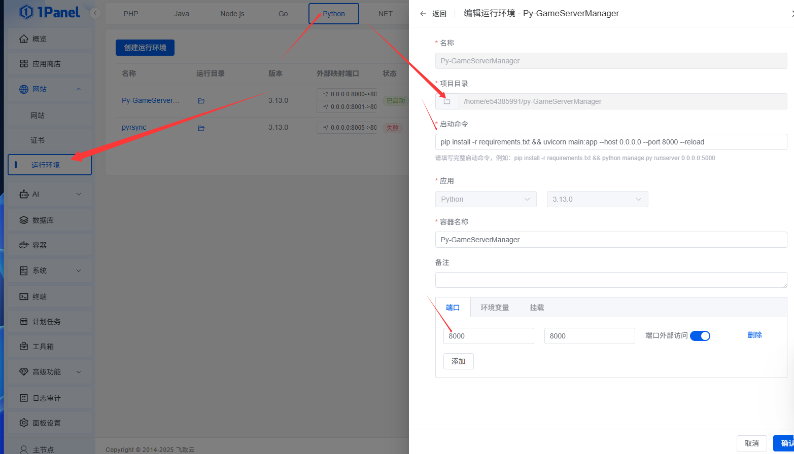

# CS2 Server Manager | CS2 服务器管理器

[English](#english) | [中文](#chinese)

---
## ⚠️ 重要网络要求（部署前必读）

<div align="center">
  <strong>为了 100% 成功部署，请确保你的网络满足以下条件：</strong>
</div>

| 要求项                 | 说明                                                                 |
|-----------------------|----------------------------------------------------------------------|
| Steam 官方服务器      | 必须能正常访问 `steampowered.com` 和 Steam 内容服务器（下载游戏文件用） |
| GitHub                | 如需要安装插件框架 需要能正常访问 `github.com` 和 `githubusercontent.com`（下载插件框架 CounterStrikeSharp 等） |
| 当前无中国加速镜像     | 项目暂未提供国内镜像，建议自行解决                        |


# 不会使用？花费 2 分钟看看视频 ↓

## 🚀 超简单部署（2分钟上手）

[](https://youtu.be/8GksFZHmO0c)

## ⚙️ 操作和管理（完整功能演示）

[](https://youtu.be/PPzykUZmNy0)

> 点图片立即播放 ·  2 分钟学会全部操作


<a name="chinese"></a>
## 📖 中文说明

### 简介

一个基于 **FastAPI + Redis + MySQL** 构建的现代化 CS2 (Counter-Strike 2) 服务器管理器。通过 SSH 远程管理多个服务器，支持一键部署、启动、停止等操作，让服务器管理变得简单高效！

### ✨ 主要特性

- ✅ **异步架构**: 完全使用 async/await 实现高性能异步操作
- 🚀 **多服务器管理**: 支持同时管理多个 CS2 服务器
- 🔗 **SSH 连接池**: 同服务器连接复用，大幅降低 SSH 连接开销（性能提升高达 90%）([查看文档](docs/SSH_CONNECTION_POOLING.md))
- 👥 **用户认证**: JWT 令牌认证，用户只能管理自己创建的服务器
- 🔑 **API 密钥**: 支持 API 密钥认证，方便用户控制服务器而无需密码交换 ([查看文档](docs/API_KEY_USAGE.md))
- 🔐 **SSH 连接**: 支持密码和密钥文件两种认证方式
- 📦 **自动部署**: 通过 SSH 自动部署 CS2 服务器
- 🎮 **服务器控制**: 启动、停止、重启服务器
- 🔄 **自动重启保护**: 服务器崩溃时自动重启，具有崩溃循环保护机制 ([查看文档](docs/AUTO_RESTART_GUIDE.md))
- 🔔 **实时状态上报**: 服务器通过 API 向管理端上报崩溃、重启等事件
- 🔌 **插件框架安装**: 一键安装 Metamod:Source 和 CounterStrikeSharp，支持批量安装和更新
- 📊 **状态监控**: 实时查看服务器状态
- 🔴 **WebSocket 实时更新**: 部署过程实时查看 SSH 状态和输出
- 💾 **Redis 缓存**: 使用 Redis 缓存服务器状态
- 📝 **操作日志**: 记录所有部署和操作历史
- 🐳 **Docker 支持**: 提供 Docker Compose 快速部署依赖
- 🎨 **现代化 Web 界面**: 基于 Bootstrap 5 + Alpine.js 的响应式界面，所有资源完全本地化

### 📋 系统要求

#### 管理端环境要求 (运行 Web 界面 您可使用1panel来快捷部署)
- **Python**: 3.13+ (推荐 3.13 或更高版本，支持 Python 3.14)
- **MySQL**: 8.0+
- **Redis**: 7.0+


#### 目标服务器 (纯净开放SSH的系统 仅运行 CS2 不需要安装管理端)
- **操作系统**: Ubuntu 24.04+


### 🚀 快速开始

#### 步骤 1: 准备服务器 一台 Web管理端(通常1核1G也够用了) + 一台游戏服务器 (推荐,当然你也可以部署到一起)

#### 步骤 2: 克隆仓库 或 下载整个源码

```bash
git clone https://github.com/e54385991/CS2-ServerManager.git
cd CS2-ServerManager
```


#### 步骤 3: 方案手动部署 安装依赖

```bash
pip install -r requirements.txt
```

#### 步骤 4: 配置数据库和 Redis

编辑 `modules/config.py` 文件，配置必要的数据库和 Redis 服务器连接信息。

**⚠️ 重要提示**: 数据库和 Redis 配置是必需的，不可省略！

**🔥 Redis 无密码特别说明**  
如果你的 Redis 服务器**没有设置密码**，请务必这样配置（否则会报错）：

```python
REDIS_PASSWORD: Optional[str] = None   # 没有密码就写 None，不要写空字符串 "" 
```

##### 使用 1Panel 部署示例

如果您使用 1Panel 部署 MySQL 和 Redis，参考配置如下：



```python
# MySQL Configuration
MYSQL_HOST: str = "1Panel-mysql-KZBC"  # 您的 MySQL 容器名或地址
MYSQL_PORT: int = 3306
MYSQL_USER: str = "cs2_manager"
MYSQL_PASSWORD: str = "password"  # 修改为您的密码
MYSQL_DATABASE: str = "cs2_manager"

# Redis Configuration
REDIS_HOST: str = "1Panel-redis-oAZc"  # 您的 Redis 容器名或地址
REDIS_PORT: int = 6379
REDIS_PASSWORD: Optional[str] = "redis_rYpBai"  # 修改为您的密码
REDIS_DB: int = 0

# Security
SECRET_KEY: str = "your-secret-key-change-this-in-production"  # 至少 32 位，建议随机生成
JWT_SECRET_KEY: str = "your-jwt-secret-key-change-this-in-production"  # 至少 32 位，建议随机生成
```

#### 步骤 5: 启动服务

使用 uvicorn 启动应用：

```bash
uvicorn main:app --host 0.0.0.0 --port 8000 --reload
```

#### 步骤 6: 访问应用

打开浏览器访问以下地址：

- **Web 界面**: http://localhost:8000/
  - 主页：功能介绍和快速导航
  - 登录/注册：http://localhost:8000/login 或 http://localhost:8000/register
  - 服务器管理：http://localhost:8000/servers-ui (需要登录)
  
- **API 文档**: 
  - Swagger UI: http://localhost:8000/docs
  - ReDoc: http://localhost:8000/redoc

#### 步骤 7: 首次登录

首次启动应用时，系统会自动创建默认管理员账户：

```
用户名: admin
密码: admin123
```

**⚠️ 安全提示**: 请在首次登录后立即修改默认密码！

---

<a name="english"></a>
## 📖 English

### Introduction

A modern CS2 (Counter-Strike 2) server manager built with **FastAPI + Redis + MySQL**. Manage multiple servers remotely via SSH with features like one-click deployment, start/stop controls, and more. Making server management simple and efficient!

### ✨ Key Features

- ✅ **Async Architecture**: High-performance async operations using async/await
- 🚀 **Multi-Server Management**: Manage multiple CS2 servers simultaneously
- 👥 **User Authentication**: JWT token authentication, users can only manage their own servers
- 🔑 **API Key Authentication**: Support API key authentication for controlling servers without password exchange ([View Docs](docs/API_KEY_USAGE.md))
- 🔐 **SSH Connection**: Supports both password and key file authentication
- 📦 **Auto Deployment**: Automatic CS2 server deployment via SSH
- 🎮 **Server Control**: Start, stop, and restart servers
- 🔄 **Auto-Restart Protection**: Automatic restart on crash with crash loop protection ([View Docs](docs/AUTO_RESTART_GUIDE.md))
- 🔔 **Real-time Status Reporting**: Servers report crash and restart events to the manager via API
- 🔌 **Plugin Framework Installation**: One-click install for Metamod:Source and CounterStrikeSharp, supports batch install and update
- 📊 **Status Monitoring**: Real-time server status monitoring
- 🔴 **WebSocket Real-time Updates**: Live SSH status and output during deployment
- 💾 **Redis Caching**: Server status caching with Redis
- 📝 **Operation Logs**: Records all deployment and operation history
- 🐳 **Docker Support**: Docker Compose for quick dependency deployment
- 🎨 **Modern Web Interface**: Responsive UI based on Bootstrap 5 + Alpine.js, all resources fully localized

### 📋 System Requirements

#### Manager Host (Running Web Interface)
- **Python**: 3.13+ (Recommended 3.13 or higher, supports Python 3.14)
- **MySQL**: 8.0+
- **Redis**: 7.0+

#### Target Server (Running CS2)
- **Operating System**: Ubuntu 24.04+

### 🚀 Quick Start

#### Step 1: Prepare Server

For detailed server preparation instructions, please refer to [DEPLOYMENT.md](docs/DEPLOYMENT.md).

#### Step 2: Clone Repository

```bash
git clone https://github.com/e54385991/CS2-ServerManager.git
cd CS2-ServerManager
```

#### Step 3: Install Dependencies

```bash
pip install -r requirements.txt
```

#### Step 4: Configure Database and Redis

Edit the `modules/config.py` file to configure the necessary database and Redis server connection information.


**🔥 Special Note for Redis WITHOUT Password**  
If your Redis server has **no password set**, you **must** configure it like this (otherwise it will error):

```python
REDIS_PASSWORD: Optional[str] = None   # No password → use None, NOT an empty string ""
```


**⚠️ Important**: Database and Redis configuration are required and cannot be omitted!

##### Example Deployment with 1Panel

If you're using 1Panel to deploy MySQL and Redis, refer to the configuration below:


```python
# MySQL Configuration
MYSQL_HOST: str = "1Panel-mysql-KZBC"  # Your MySQL container name or address
MYSQL_PORT: int = 3306
MYSQL_USER: str = "cs2_manager"
MYSQL_PASSWORD: str = "password"  # Change to your password
MYSQL_DATABASE: str = "cs2_manager"

# Redis Configuration
REDIS_HOST: str = "1Panel-redis-oAZc"  # Your Redis container name or address
REDIS_PORT: int = 6379
REDIS_PASSWORD: Optional[str] = "redis_rYpBai"  # Change to your password
REDIS_DB: int = 0

# Security
SECRET_KEY: str = "your-secret-key-change-this-in-production"  # At least 32 characters, randomly generated recommended
JWT_SECRET_KEY: str = "your-jwt-secret-key-change-this-in-production"  # At least 32 characters, randomly generated recommended
```

#### Step 5: Start Service

Start the application using uvicorn:

```bash
uvicorn main:app --host 0.0.0.0 --port 8000 --reload
```

#### Step 6: Access Application

Open your browser and visit:

- **Web Interface**: http://localhost:8000/
  - Homepage: Feature introduction and quick navigation
  - Login/Register: http://localhost:8000/login or http://localhost:8000/register
  - Server Management: http://localhost:8000/servers-ui (login required)
  
- **API Documentation**: 
  - Swagger UI: http://localhost:8000/docs
  - ReDoc: http://localhost:8000/redoc

#### Step 7: First Login

On first startup, the system automatically creates a default admin account:

```
Username: admin
Password: admin123
```

**⚠️ Security Notice**: Please change the default password immediately after first login!

---

### 📄 License

MIT License

### 💬 Support

If you have any questions, please create an Issue or contact the maintainer.
