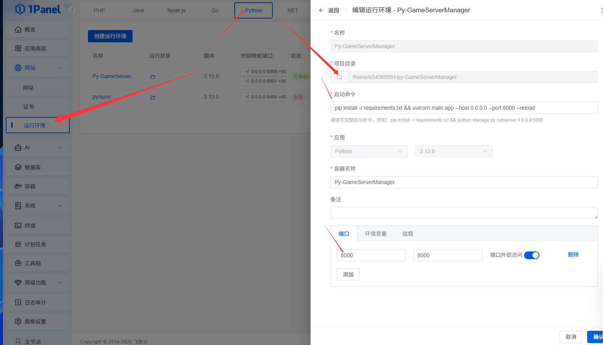

# CS2 Server Manager | CS2 服务器管理器


[](https://fastapi.tiangolo.com)
[](https://www.python.org)
[](https://redis.io)


[English](#english) | [中文](#chinese)

---
## ⚠️ 重要网络要求（部署前必读）

<div align="center">
  <strong>为了 100% 成功部署，请确保你的网络满足以下条件：</strong>
</div>

| 要求项                 | 说明                                                                 |
|-----------------------|----------------------------------------------------------------------|
| Steam 官方服务器      | 必须能正常访问 `steampowered.com` 和 Steam 内容服务器（下载游戏文件用） |
| GitHub                | 如需要安装插件框架 需要能正常访问 `github.com` 和 `githubusercontent.com`（下载插件框架 CounterStrikeSharp 等）<br/>**新功能：** 现已支持服务器级 GitHub 代理配置（如 https://ghfast.top），方便中国大陆用户 |
| Github国内加速支持     |  **已支持 GitHub 代理配置，可在服务器配置中设置 支持面板代理或github url代理2种方法**                        |

### 🌍 推荐部署方案（中国大陆用户）

**💡 强烈推荐：将 Web 管理端部署到海外服务器（如美国、香港、新加坡等 和你的游戏服务器网络相对友好最佳）**

这样可以启用**面板服务器代理模式**，实现插件安装无障碍：

```
┌─────────────────────────────────────────────────────────────────┐
│                    面板代理模式工作流程                           │
└─────────────────────────────────────────────────────────────────┘

  ①下载                    ②上传                    ③安装
GitHub ──────> 海外面板服务器 ──────> 国内游戏服务器 ──────> 完成
           (顺畅访问GitHub)      (SFTP传输)        (本地安装)
           
优势：
✅ 所有下载(SteamCMD、插件、框架)都通过海外面板中转
✅ 实时进度显示(下载50% → 上传50%)
✅ 无需第三方代理服务，完全自主控制
✅ 与 GitHub URL 代理二选一，面板代理更全面
```

**配置方法**：
1. 将 Web 管理端部署到海外服务器（推荐美国、香港、新加坡等地）
2. 游戏服务器可在任何位置（包括中国大陆）
3. 在服务器配置页面启用"使用面板服务器代理"
4. 享受无障碍的插件安装体验！


# 不会使用？花费 2 分钟看看视频 ↓

## 📚 新手教程

### 🌐 部署教程
**从 0 开始部署 CS2 游戏服务器？** 查看我们的详细图文教程：
- [如何使用本面板部署CS2游戏服务器](docs/ALIYUN_ECS_DEPLOY.md)

## 🚀 管理面板 超简单部署（2分钟上手）

[](https://youtu.be/8GksFZHmO0c)

## ⚙️ 管理面板 操作和管理（完整功能演示）

[](https://youtu.be/PPzykUZmNy0)

> 点图片立即播放 ·  2 分钟学会全部操作


<a name="chinese"></a>
## 📖 中文说明

### 简介

一个基于 **FastAPI + Redis + MySQL** 构建的现代化 CS2 (Counter-Strike 2) 服务器管理器。通过 SSH 远程管理多个服务器，支持一键部署、启动、停止等操作，让服务器管理变得简单高效！

### ✨ 主要特性

- ✅ **异步架构**: 完全使用 async/await 实现高性能异步操作
- 🚀 **多服务器管理**: 支持同时管理多个 CS2 服务器
- 🔗 **SSH 连接池**: 同服务器连接复用，大幅降低 SSH 连接开销（性能提升高达 90%）([查看文档](docs/SSH_CONNECTION_POOLING.md))
- 👥 **用户认证**: JWT 令牌认证，用户只能管理自己创建的服务器
- 🔑 **API 密钥**: 支持 API 密钥认证，方便用户控制服务器而无需密码交换 ([查看文档](docs/API_KEY_USAGE.md))
- 🔐 **SSH 连接**: 支持密码和密钥文件两种认证方式
- 📦 **自动部署**: 通过 SSH 自动部署 CS2 服务器
- 🎮 **服务器控制**: 启动、停止、重启服务器
- 🖥️ **可选会话管理器**: 每台服务器可选择 GNU screen 或 tmux，Web 控制台、指令发送和生命周期操作均保持可用
- 🔄 **自动重启保护**: 服务器崩溃时自动重启，具有崩溃循环保护机制 ([查看文档](docs/AUTO_RESTART_GUIDE.md))
- 🔔 **实时状态上报**: 服务器通过 API 向管理端上报崩溃、重启等事件
- 🔌 **插件框架安装**: 一键安装 Metamod:Source 和 CounterStrikeSharp，支持批量安装和更新
- ☁️ **S3 兼容备份**: 插件备份可上传到 AWS S3、Cloudflare R2、MinIO、阿里云 OSS S3 API 等兼容存储，并按策略保留（默认每台服务器 10 份）防止无限增长
- 🌐 **面板服务器代理**: **推荐将管理端部署到海外**，启用面板代理模式实现所有下载（SteamCMD、GitHub 插件、框架）通过面板中转，完美解决网络限制问题 ([查看文档](docs/GITHUB_PROXY.md))
- 🔗 **GitHub URL 代理**: 服务器级 GitHub URL 代理支持（如 ghfast.top），与面板代理二选一
- 📊 **状态监控**: 实时查看服务器状态
- 🔴 **WebSocket 实时更新**: 部署过程实时查看 SSH 状态和输出
- 💾 **Redis 缓存**: 使用 Redis 缓存服务器状态
- 📝 **操作日志**: 记录所有部署和操作历史
- 🐳 **Docker 支持**: 提供 Docker Compose 快速部署依赖
- 🎨 **现代化 Web 界面**: 基于 Bootstrap 5 + Alpine.js 的响应式界面，所有资源完全本地化

### 📋 系统要求

#### 管理端环境要求 (运行 Web 界面 您可使用[1Panel](https://github.com/1Panel-dev/1Panel)来快捷部署)
- **Python**: 3.14+ (推荐 Python 3.14 或更高版本)
- **MySQL**: 8.0+
- **Redis**: 7.0+


#### 目标服务器 (纯净开放SSH的系统 仅运行 CS2 不需要安装管理端)
- **操作系统**: Ubuntu 24.04+ 或 Debian 13+(请勿以英语以外的语言安装 务必选择 英语原版 以免web控制端获取不正确的服务器反馈)


### 🚀 快速开始

#### 步骤 1: 准备服务器 一台 Web管理端(通常1核1G也够用了) + 一台游戏服务器 (推荐,当然你也可以部署到一起)

#### 步骤 2: 克隆仓库 或 下载整个源码

```bash
git clone https://github.com/e54385991/UpKK-CS2-ServerManager.git
cd UpKK-CS2-ServerManager
```


#### 步骤 3: 配置数据库和 Redis

编辑 `modules/config.py` 文件，配置必要的数据库和 Redis 服务器连接信息。

**⚠️ 重要提示**: 数据库和 Redis 配置是必需的，不可省略！

**🔥 Redis 无密码特别说明**  
如果你的 Redis 服务器**没有设置密码**，请务必这样配置（否则会报错）：

```python
REDIS_PASSWORD: Optional[str] = None   # 没有密码就写 None，不要写空字符串 "" 
```

##### 使用 [1Panel](https://github.com/1Panel-dev/1Panel) 部署示例 (推荐使用 1Panel 运行环境-Python 3.14 来部署更容易)

如果您使用 1Panel 部署 MySQL 和 Redis，参考配置如下：



```python
# 文件位置: modules/config.py
# MySQL Configuration
MYSQL_HOST: str = "1Panel-mysql-KZBC"  # 您的 MySQL 容器名或地址
MYSQL_PORT: int = 3306
MYSQL_USER: str = "cs2_manager"
MYSQL_PASSWORD: str = "password"  # 修改为您的密码
MYSQL_DATABASE: str = "cs2_manager"

# Redis Configuration
REDIS_HOST: str = "1Panel-redis-oAZc"  # 您的 Redis 容器名或地址
REDIS_PORT: int = 6379
REDIS_PASSWORD: Optional[str] = "redis_rYpBai"  # 修改为您的密码
REDIS_DB: int = 0

# Security
SECRET_KEY: str = "your-secret-key-change-this-in-production"  # 至少 32 位，建议随机生成
JWT_SECRET_KEY: str = "your-jwt-secret-key-change-this-in-production"  # 至少 32 位，建议随机生成
```

#### 步骤 4: 启动服务

使用 uvicorn 启动应用([1Panel](https://github.com/1Panel-dev/1Panel) 启动命令相同)：

```bash
pip install uv && uv run --python 3.14 --locked uvicorn main:app --host 0.0.0.0 --port 8000 --reload
```

#### 步骤 5: 访问应用

打开浏览器访问以下地址：

- **Web 界面**: http://localhost:8000/
  - 主页：功能介绍和快速导航
  - 登录/注册：http://localhost:8000/login 或 http://localhost:8000/register
  - 服务器管理：http://localhost:8000/servers-ui (需要登录)
  
- **API 文档**: 
  - Swagger UI: http://localhost:8000/docs
  - ReDoc: http://localhost:8000/redoc

#### 步骤 6: 首次登录

首次启动应用时，系统会自动创建默认管理员账户：

```
用户名: admin
密码: admin123
```

**⚠️ 安全提示**: 请在首次登录后立即修改默认密码！

### 🔧 关于自动初始化

在通过管理端初始化目标服务器时，系统会自动创建一个名为 `cs2server` 的用户来运行 CS2 服务器。该用户使用**普通用户级权限**，不具有 root 权限，这样可以：

- 🛡️ 提高安全性，防止 CS2 进程以 root 权限运行
- 📦 隔离游戏服务器与系统其他部分
- 🔒 限制潜在安全风险的影响范围

### ⚠️ 安全配置（可选但强烈建议）

如果您的管理后台允许公共访问（即可通过公网 IP 访问），请务必采取以下安全措施：

1. **使用 Nginx 反向代理并配置 TLS 证书**
   - 配置 HTTPS 加密传输，保护登录凭据和 API 通信
   - 推荐使用 Let's Encrypt 免费证书

2. **⚠️ 重要警告：在未配置 TLS 前，请勿输入任何敏感信息！**
   - 这包括：SSH 密码、API 密钥、数据库凭据等
   - 未加密的 HTTP 连接可能导致敏感信息被窃取

示例 Nginx 配置片段：

```nginx
server {
    listen 443 ssl;
    server_name your-domain.com;
    
    ssl_certificate /path/to/cert.pem;
    ssl_certificate_key /path/to/key.pem;
    
    location / {
        proxy_pass http://127.0.0.1:8000;
        proxy_set_header Host $host;
        proxy_set_header X-Real-IP $remote_addr;
        proxy_set_header X-Forwarded-For $proxy_add_x_forwarded_for;
        proxy_set_header X-Forwarded-Proto $scheme;
        # 大型压缩包目录检查可能需要完整扫描 tar.gz。
        proxy_read_timeout 3600s;
        proxy_send_timeout 3600s;
    }
}
```

---

<a name="english"></a>
## 📖 English

### Introduction

A modern CS2 (Counter-Strike 2) server manager built with **FastAPI + Redis + MySQL**. Manage multiple servers remotely via SSH with features like one-click deployment, start/stop controls, and more. Making server management simple and efficient!

### ✨ Key Features

- ✅ **Async Architecture**: High-performance async operations using async/await
- 🚀 **Multi-Server Management**: Manage multiple CS2 servers simultaneously
- 🔗 **SSH Connection Pool**: Connection reuse for same servers, significantly reducing SSH overhead (up to 90% performance improvement) ([View Docs](docs/SSH_CONNECTION_POOLING.md))
- 👥 **User Authentication**: JWT token authentication, users can only manage their own servers
- 🔑 **API Key Authentication**: Support API key authentication for controlling servers without password exchange ([View Docs](docs/API_KEY_USAGE.md))
- 🔐 **SSH Connection**: Supports both password and key file authentication
- 📦 **Auto Deployment**: Automatic CS2 server deployment via SSH
- 🎮 **Server Control**: Start, stop, and restart servers
- 🖥️ **Selectable Session Manager**: Choose GNU screen or tmux per server while retaining Web console, command, and lifecycle support
- 🔄 **Auto-Restart Protection**: Automatic restart on crash with crash loop protection ([View Docs](docs/AUTO_RESTART_GUIDE.md))
- 🔔 **Real-time Status Reporting**: Servers report crash and restart events to the manager via API
- 🔌 **Plugin Framework Installation**: One-click install for Metamod:Source and CounterStrikeSharp, supports batch install and update
- ☁️ **S3-Compatible Backups**: Upload plugin backups to AWS S3, Cloudflare R2, MinIO, Aliyun OSS S3 API, and other compatible storage with retention enforcement (10 per server by default)
- 🌐 **Panel Server Proxy**: **Recommended to deploy manager overseas**, enable panel proxy mode for all downloads (SteamCMD, GitHub plugins, frameworks) to bypass network restrictions ([View Docs](docs/GITHUB_PROXY.md))
- 🔗 **GitHub URL Proxy**: Server-level GitHub URL proxy support (e.g., ghfast.top), choose one between panel proxy and URL proxy
- 📊 **Status Monitoring**: Real-time server status monitoring
- 🔴 **WebSocket Real-time Updates**: Live SSH status and output during deployment
- 💾 **Redis Caching**: Server status caching with Redis
- 📝 **Operation Logs**: Records all deployment and operation history
- 🐳 **Docker Support**: Docker Compose for quick dependency deployment
- 🎨 **Modern Web Interface**: Responsive UI based on Bootstrap 5 + Alpine.js, all resources fully localized

### 🌍 Recommended Deployment (For Users in China)

**💡 Highly Recommended: Deploy Web Manager to Overseas Servers (US, Hong Kong, Singapore, etc.)**

This enables **Panel Server Proxy Mode** for seamless plugin installation:

```
┌──────────────────────────────────────────────────────────────────┐
│                 Panel Proxy Mode Workflow                        │
└──────────────────────────────────────────────────────────────────┘

  ①Download               ②Upload                 ③Install
GitHub ──────> Overseas Panel ──────> China Game Server ──────> Done
           (Smooth GitHub)      (SFTP)           (Local)
           
Benefits:
✅ All downloads (SteamCMD, plugins, frameworks) relay through overseas panel
✅ Real-time progress (Download 50% → Upload 50%)
✅ No third-party proxy needed, full control
✅ Choose between panel proxy or GitHub URL proxy, panel is more comprehensive
```

**Setup:**
1. Deploy Web Manager to overseas server (recommend US, Hong Kong, Singapore)
2. Game server can be anywhere (including China mainland)
3. Enable "Use Panel Server Proxy" in server configuration
4. Enjoy seamless plugin installation!

For details: [Panel Proxy Documentation](docs/GITHUB_PROXY.md)

### 📋 System Requirements

#### Manager Host (Running Web Interface - You can use [1Panel](https://github.com/1Panel-dev/1Panel) for quick deployment)
- **Python**: 3.14+ (Recommended Python 3.14 or higher)
- **MySQL**: 8.0+
- **Redis**: 7.0+

#### Target Server (Running CS2)
- **Operating System**: Ubuntu 24.04+ OR Debian 13+

### 🚀 Quick Start

#### 📚 Beginner Tutorial

**Starting from scratch?** Check out our detailed step-by-step guide:
- [How to Deploy CS2 Game Server Using This Panel](docs/ALIYUN_ECS_DEPLOY.md) (Chinese)

#### Step 1: Prepare Server

For detailed server preparation instructions, please refer to [DEPLOYMENT.md](docs/DEPLOYMENT.md).

#### Step 2: Clone Repository

```bash
git clone https://github.com/e54385991/UpKK-CS2-ServerManager.git
cd UpKK-CS2-ServerManager
```

#### Step 3: Install Dependencies

```bash
pip install uv && uv sync --locked
```

#### Step 4: Configure Database and Redis

Edit the `modules/config.py` file to configure the necessary database and Redis server connection information.


**🔥 Special Note for Redis WITHOUT Password**  
If your Redis server has **no password set**, you **must** configure it like this (otherwise it will error):

```python
REDIS_PASSWORD: Optional[str] = None   # No password → use None, NOT an empty string ""
```


**⚠️ Important**: Database and Redis configuration are required and cannot be omitted!

##### Example Deployment with [1Panel](https://github.com/1Panel-dev/1Panel) (Recommended: Use 1Panel Runtime Environment - Python 3.14 for easier deployment)

If you're using 1Panel to deploy MySQL and Redis, refer to the configuration below:


```python
# MySQL Configuration
MYSQL_HOST: str = "1Panel-mysql-KZBC"  # Your MySQL container name or address
MYSQL_PORT: int = 3306
MYSQL_USER: str = "cs2_manager"
MYSQL_PASSWORD: str = "password"  # Change to your password
MYSQL_DATABASE: str = "cs2_manager"

# Redis Configuration
REDIS_HOST: str = "1Panel-redis-oAZc"  # Your Redis container name or address
REDIS_PORT: int = 6379
REDIS_PASSWORD: Optional[str] = "redis_rYpBai"  # Change to your password
REDIS_DB: int = 0

# Security
SECRET_KEY: str = "your-secret-key-change-this-in-production"  # At least 32 characters, randomly generated recommended
JWT_SECRET_KEY: str = "your-jwt-secret-key-change-this-in-production"  # At least 32 characters, randomly generated recommended
```

#### Step 5: Start Service

Start the application using uvicorn (same command for 1Panel startup):

```bash
pip install uv && uv run --python 3.14 --locked uvicorn main:app --host 0.0.0.0 --port 8000 --reload
```

#### Step 6: Access Application

Open your browser and visit:

- **Web Interface**: http://localhost:8000/
  - Homepage: Feature introduction and quick navigation
  - Login/Register: http://localhost:8000/login or http://localhost:8000/register
  - Server Management: http://localhost:8000/servers-ui (login required)
  
- **API Documentation**: 
  - Swagger UI: http://localhost:8000/docs
  - ReDoc: http://localhost:8000/redoc

#### Step 7: First Login

On first startup, the system automatically creates a default admin account:

```
Username: admin
Password: admin123
```

**⚠️ Security Notice**: Please change the default password immediately after first login!

### 🔧 About Auto-Initialization

When initializing target servers through the management interface, the system automatically creates a user named `cs2server` to run the CS2 server. This user operates with **regular user-level privileges** (non-root), which provides:

- 🛡️ Enhanced security by preventing CS2 processes from running with root privileges
- 📦 Isolation of the game server from other system components
- 🔒 Limited impact scope for potential security risks

### ⚠️ Security Configuration (Optional but Highly Recommended)

If your management console is publicly accessible (i.e., accessible via public IP), please implement the following security measures:

1. **Use Nginx Reverse Proxy with TLS Certificate**
   - Configure HTTPS encrypted transmission to protect login credentials and API communications
   - Recommended: Use Let's Encrypt free certificates

2. **⚠️ Important Warning: Do NOT enter any sensitive information before TLS is configured!**
   - This includes: SSH passwords, API keys, database credentials, etc.
   - Unencrypted HTTP connections may result in sensitive information being intercepted

Example Nginx configuration snippet:

```nginx
server {
    listen 443 ssl;
    server_name your-domain.com;
    
    ssl_certificate /path/to/cert.pem;
    ssl_certificate_key /path/to/key.pem;
    
    location / {
        proxy_pass http://127.0.0.1:8000;
        proxy_set_header Host $host;
        proxy_set_header X-Real-IP $remote_addr;
        proxy_set_header X-Forwarded-For $proxy_add_x_forwarded_for;
        proxy_set_header X-Forwarded-Proto $scheme;
        # Large archive inspection may need to scan the complete tar.gz file.
        proxy_read_timeout 3600s;
        proxy_send_timeout 3600s;
    }
}
```

---

### 📄 License

MIT License

### 💬 Support

If you have any questions, please create an Issue or contact the maintainer.
