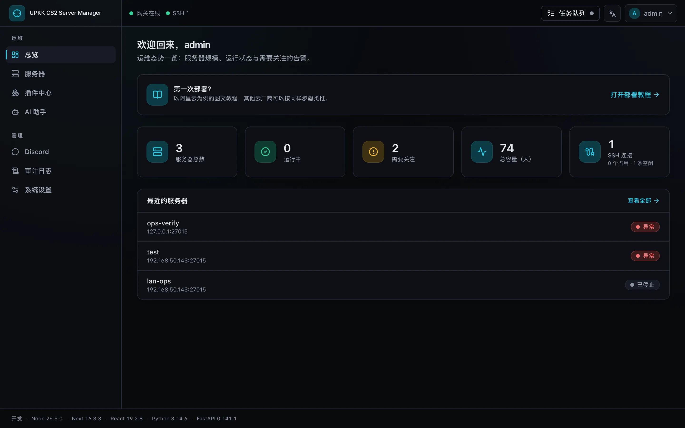
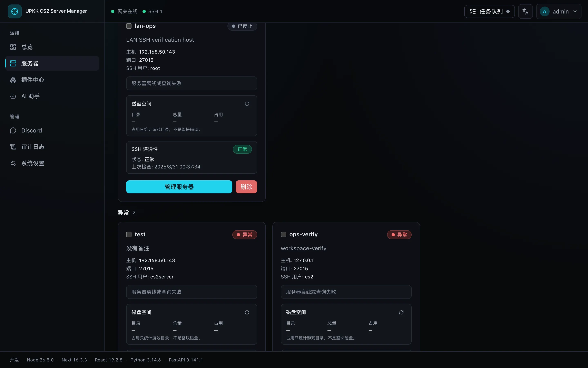
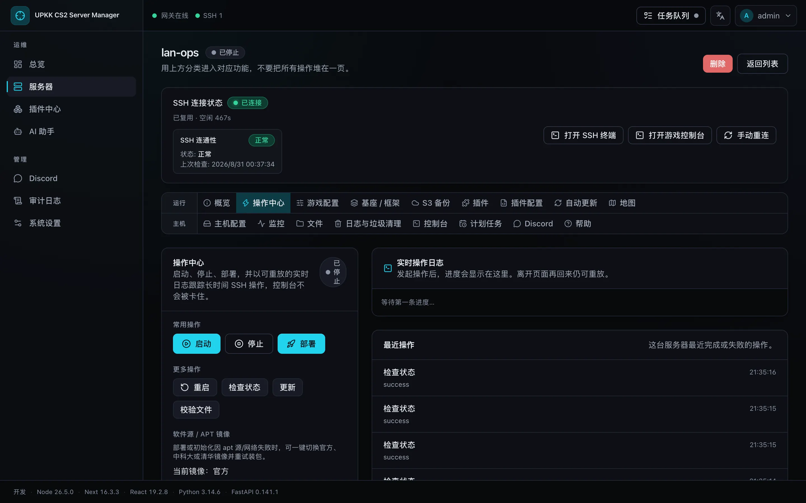
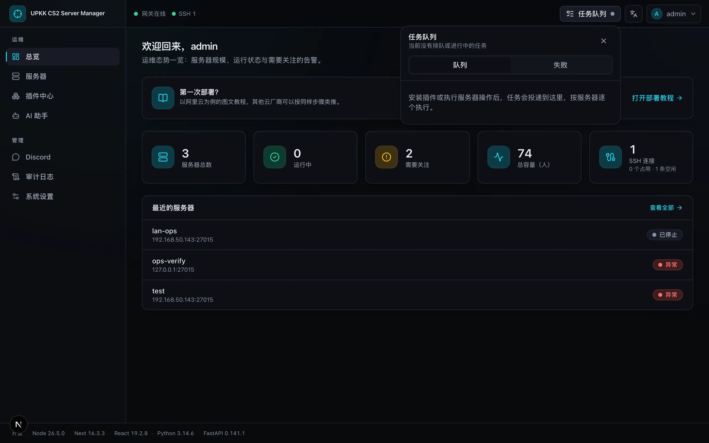
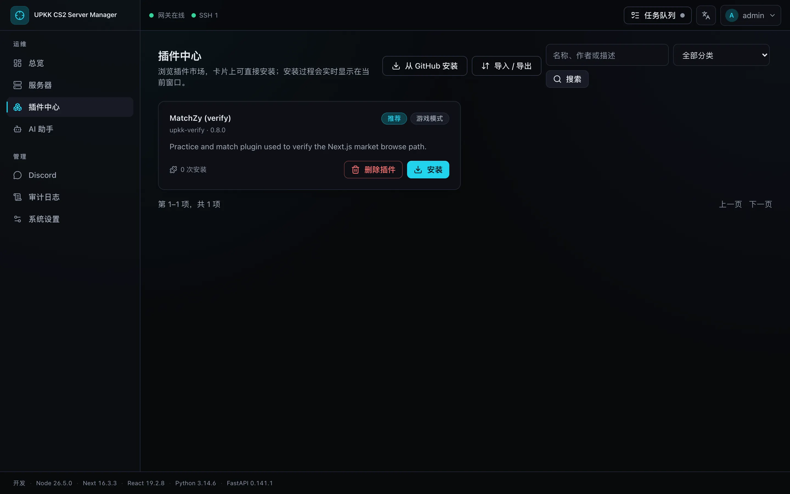
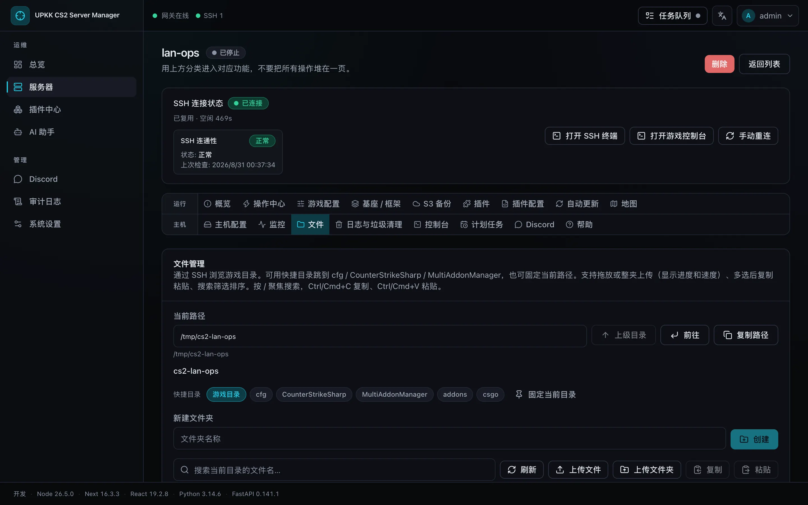
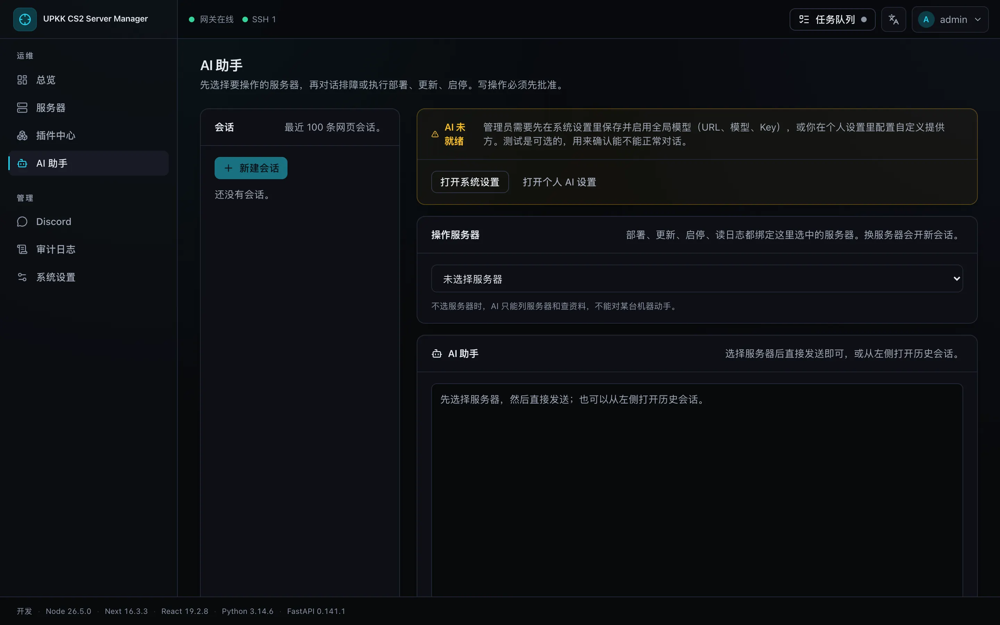

# CS2 Server Manager

[English](README.md) | [简体中文](README.zh-CN.md)

[](https://fastapi.tiangolo.com)
[](https://www.python.org)
[](docs/DOCKER_QUICKSTART.md)

> 🚀 **Docker one-click deployment is recommended.** There is no need to
> install Python, PostgreSQL, or Redis manually—a single command starts the
> complete management panel.
>
> [1Panel quick deployment](docs/1PANEL_QUICKSTART.md) is also supported. See
> the [full documentation](docs/README.md) for more information.

## Overview

CS2 Server Manager is a modern, web-based **multi-server management panel for
Counter-Strike 2**. The current console is a **Next.js** app that talks to a
FastAPI backend. It connects to one or more game hosts over SSH so you can
deploy, start, stop, update, monitor, and manage plugins entirely from the
browser.

The management panel and game servers can run on the same machine or on
separate hosts. We recommend running the panel on a dedicated host and managing
game servers over SSH. That setup is easier to maintain and keeps management
services from competing with the game process.

### Console



The overview shows fleet size, running state, items that need attention, SSH
pool usage, and a link to the illustrated deployment tutorial. The left
navigation stays visible while you move between pages.

### Key features

- Deploy, start, stop, restart, and update CS2 servers with one click
- Manage many hosts from one console and watch status, logs, and job progress
- Host initialization wizard: create the `cs2server` user, install packages,
  and reuse saved SSH accounts
- Web file manager, live SSH/game consoles, and common game/host settings
- Plugin marketplace plus GitHub installs for Metamod:Source,
  CounterStrikeSharp, and related plugins
- Delivery queue for long jobs (deploy, plugin install): POST and leave; one
  worker runs at a time per game server
- Activity tray for queued, running, and failed jobs (failures kept 7 days)
- Automatic restart protection, automatic updates, and scheduled tasks
- Password or SSH-key auth, user permissions, and API keys
- S3-compatible backups with retention policies
- Panel download relay and GitHub URL proxy for restricted networks
- Bilingual console (zh-CN / en-US)
- FastAPI + PostgreSQL + Redis; Docker prepares dependencies and applies
  database migrations

### Servers and operations



The servers list shows status, A2S info, disk usage, and SSH health. You can
filter the fleet, run bulk plugin installs or commands, then open a host
workspace.



The operations center starts, stops, deploys, and updates a host. Long jobs
go into the delivery queue. Watch progress in the live log or the top-right
activity tray—you do not wait on the form while SteamCMD runs.



### Plugins and files



Browse the plugin market, install from a card or a GitHub repository, and
follow the same replayable log in the activity tray.



The file manager browses the game directory over SSH, with shortcuts, upload,
folder upload, extract, copy/paste, and search.

### AI assistant



The assistant can inspect a selected server and propose operational steps.
Write actions require approval. Configure the model in system or personal
settings.

### How it works

1. Deploy the management panel with the command below
2. Sign in and change the default password immediately
3. Initialize the game host, then add its SSH details
4. Click **Deploy** in the operations center and follow the activity tray

An illustrated walkthrough is available in the console at
`/deployment-tutorial` (also linked from Overview) and in
[docs/ALIYUN_ECS_DEPLOY.md](docs/ALIYUN_ECS_DEPLOY.md).

## Install prerequisites

Update the package index and make sure `curl` is installed:

```bash
sudo apt update && sudo apt install -y curl
```

## Docker quick deployment

Use a fresh **Ubuntu 24.04+** or **Debian 13+** host for the management panel.
Run the following command as a user with `sudo` privileges:

```bash
curl -fsSL https://raw.githubusercontent.com/e54385991/UpKK-CS2-ServerManager/main/docker-quickstart.sh | bash
```

The script automatically:

- Installs Docker Engine and the Docker Compose plugin
- Generates a random database password
- Downloads the self-contained Compose file and starts Next, FastAPI,
  PostgreSQL, and Redis from Docker Hub
- Applies database migrations and waits until the console and `/health`
  proxy respond

When deployment is complete, open:

```text
http://YOUR_SERVER_IP:3000
```

Default credentials for the first sign-in:

```text
Username: admin
Password: admin123
```

> ⚠️ **Change the default password immediately after your first sign-in.** If
> the page is unreachable, make sure TCP port `3000` is allowed by both your
> cloud security group and system firewall. For a public production service,
> configure a domain name and HTTPS.

On 1Panel, paste the root `docker-compose.yml` into **Containers → Compose**.
Do not deploy the frontend and backend as two separate runtimes.

The management panel is now ready; you do not need to clone the repository or
configure the database manually. For upgrades, backups, logs, port changes,
and troubleshooting, see the [Docker quick deployment guide](docs/DOCKER_QUICKSTART.md).

## Documentation

This README covers only the shortest deployment path. Use the relevant guide
below when you need additional features.

### Deployment and getting started

| Task | Guide |
| --- | --- |
| Upgrade or back up Docker deployments and troubleshoot issues | [Docker quick deployment](docs/DOCKER_QUICKSTART.md) |
| Reuse PostgreSQL and Redis with 1Panel | [1Panel quick deployment](docs/1PANEL_QUICKSTART.md) |
| Prepare a target server to run CS2 | [Game server deployment requirements](docs/DEPLOYMENT.md) |
| Add and deploy a game server from scratch | [Beginner's illustrated guide](docs/ALIYUN_ECS_DEPLOY.md) |
| Browse all documentation | [Documentation center](docs/README.md) |

### Common features

| Task | Guide |
| --- | --- |
| Use the web console and run commands | [Console usage guide](docs/CONSOLE_USAGE_GUIDE.md) |
| Install and manage plugins | [Plugin installation guide](docs/PLUGIN_INSTALLATION_GUIDE.md) |
| Configure automatic restarts | [Automatic restart guide](docs/AUTO_RESTART_GUIDE.md) |
| Configure automatic updates | [Automatic update guide](docs/AUTO_UPDATE_GUIDE.md) |
| Configure scheduled tasks | [Scheduled tasks guide](docs/SCHEDULED_TASKS.md) |
| Configure a GitHub download proxy | [Panel proxy guide](docs/GITHUB_PROXY.md) |
| Use API keys | [API key usage guide](docs/API_KEY_USAGE.md) |

> Most linked guides are currently available in Simplified Chinese.

### Video tutorials

- [Management panel walkthrough and feature demo](https://youtu.be/PPzykUZmNy0)

## Getting help

Check the [documentation center](docs/README.md) first. If the issue remains,
open a [GitHub issue](https://github.com/e54385991/UpKK-CS2-ServerManager/issues)
and include your operating system version, deployment method, and relevant
logs.
