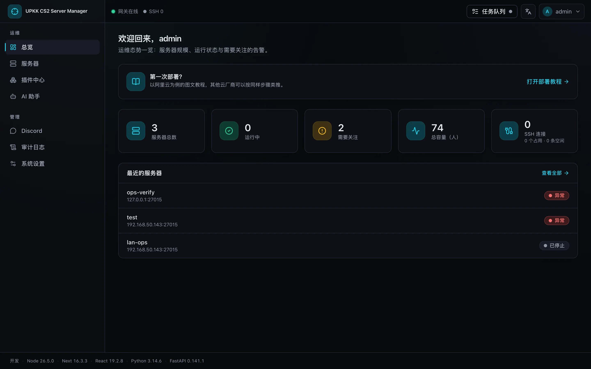
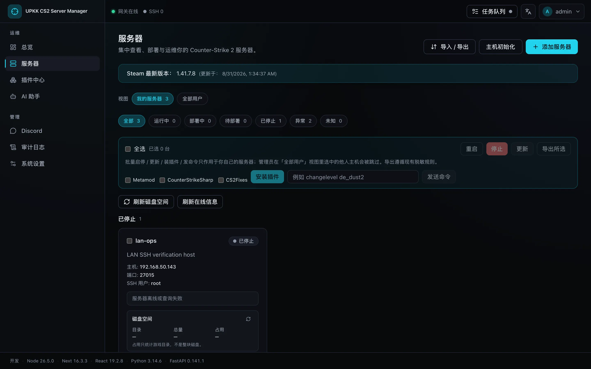
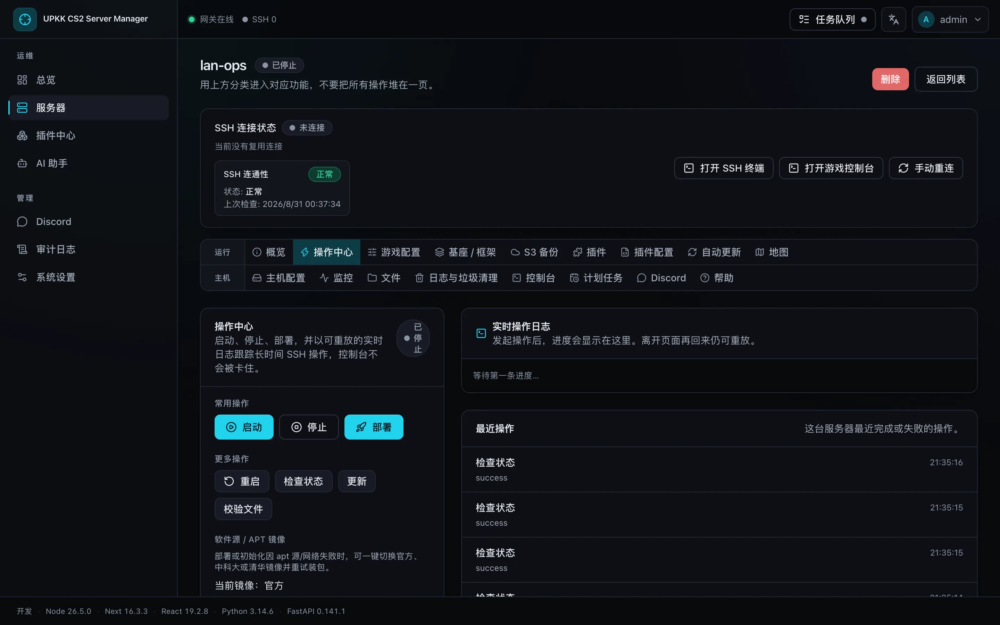
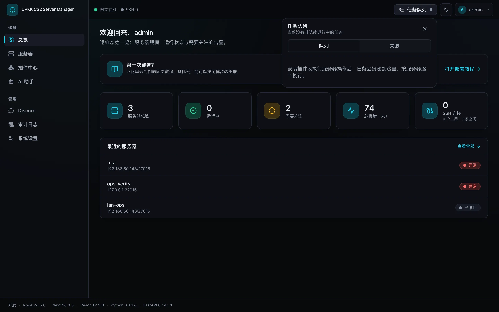
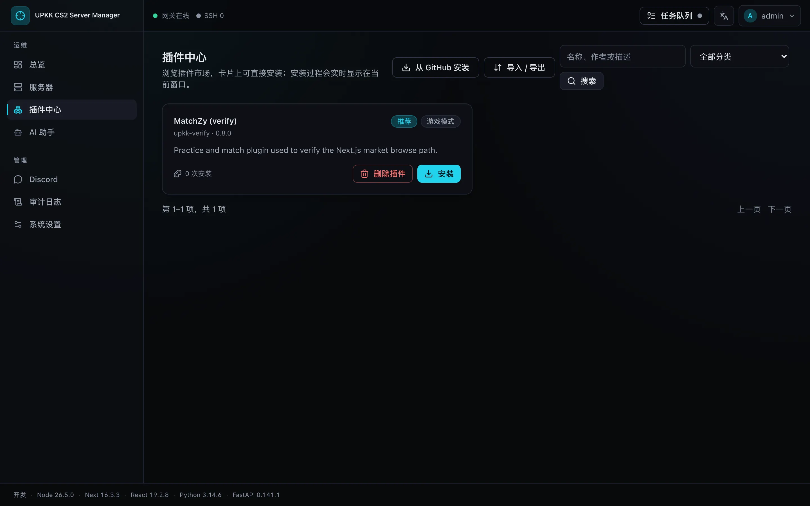
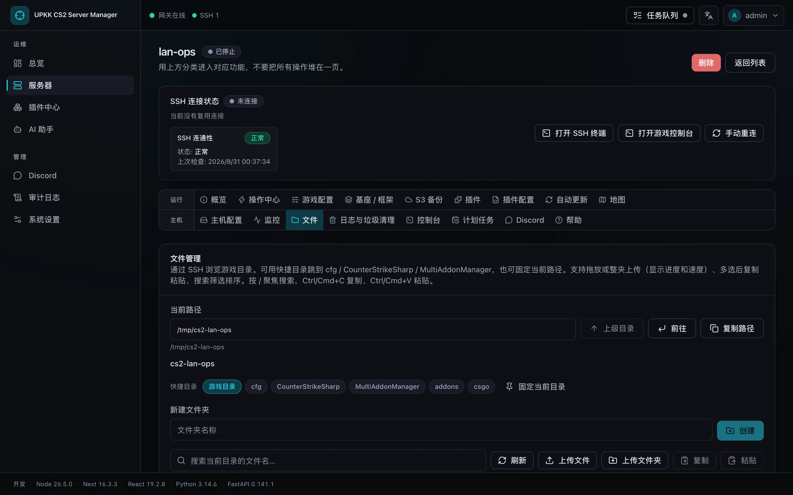
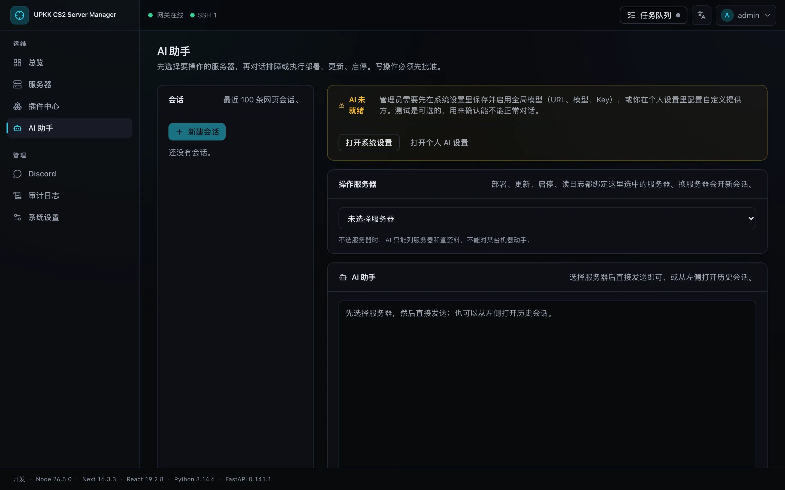

# CS2 Server Manager | CS2 服务器管理器

[English](README.md) | [简体中文](README.zh-CN.md)

[](https://fastapi.tiangolo.com)
[](https://www.python.org)
[](docs/DOCKER_QUICKSTART.md)

> 🚀 **推荐使用 Docker 一键部署。** 无需手动安装 Python、PostgreSQL 或 Redis，
> 一条命令即可启动完整管理面板。
>
> 同时支持 [1Panel 快速部署](docs/1PANEL_QUICKSTART.md)，更多内容见
> [完整文档](docs/README.md)。

## 项目说明

CS2 Server Manager 是一个现代化的 **Counter-Strike 2 多服务器 Web 管理面板**。
当前控制台是 **Next.js** 应用，后端为 FastAPI。面板通过 SSH 连接一台或多台
游戏主机，部署、启动、停止、更新、监控和插件管理都可以在浏览器中完成。

管理面板与游戏服务器可以部署在同一台主机，也可以分开部署。推荐将管理面板放在
独立主机上，通过 SSH 管理游戏服务器；这样更容易维护，也不会让管理服务与游戏
进程互相影响。

### 控制台



总览页展示服务器规模、运行状态、需要关注的告警、SSH 连接池，以及部署教程入口。
在页面之间切换时，左侧导航会保持可见。

### 主要功能

- 一键部署、启动、停止、重启和更新 CS2 服务器
- 集中管理多台主机，实时查看状态、日志和任务进度
- 主机初始化向导：创建 `cs2server` 用户、安装依赖，并可复用已保存的 SSH 账户
- Web 文件管理、SSH / 游戏实时控制台，以及常用游戏与主机配置
- 插件市场，并支持从 GitHub 安装 Metamod:Source、CounterStrikeSharp 及相关插件
- 长任务走投递队列（部署、插件安装）：提交后即可离开，同一台游戏主机一次只跑一个任务
- 右上角活动托盘查看排队、进行中和失败任务（失败记录保留 7 天）
- 自动重启保护、自动更新和计划任务
- 密码或 SSH 密钥认证，并提供用户权限和 API Key
- S3 兼容存储备份以及备份保留策略
- 面板中转和 GitHub URL 代理，方便受限网络环境下载
- 控制台中英双语（zh-CN / en-US）
- 管理面板基于 FastAPI、PostgreSQL 和 Redis，Docker 部署会自动准备全部依赖并执行数据库迁移

### 服务器与操作中心



服务器列表展示状态、A2S 信息、磁盘占用和 SSH 健康度。可以按状态筛选、批量安装
插件或发送命令，再进入单台主机的工作区。



操作中心负责启动、停止、部署和更新。长任务进入投递队列，进度在实时日志或右上角
活动托盘里查看，不必停在表单等待 SteamCMD。



### 插件与文件



浏览插件市场，从卡片或 GitHub 仓库安装，安装过程同样出现在活动托盘。



文件管理通过 SSH 浏览游戏目录，支持快捷目录、上传、整夹上传、解压、复制粘贴和搜索。

### AI 助手



助手可以针对已选服务器做排查和建议。写操作需要先确认。模型在系统设置或个人设置中配置。

### 使用流程

1. 使用下方命令部署管理面板
2. 登录面板并立即修改默认密码
3. 先做主机初始化，再添加 SSH 连接信息
4. 在操作中心点击部署，随后在活动托盘跟踪进度

控制台内的图文教程在 `/deployment-tutorial`（总览页也有入口），文档版见
[docs/ALIYUN_ECS_DEPLOY.md](docs/ALIYUN_ECS_DEPLOY.md)。

## 先更新下软件包 和 确保 CURL存在

```bash
sudo apt update && sudo apt install -y curl
```

## Docker 快速部署

适用于全新的 **Ubuntu 24.04+** 或 **Debian 13+** 管理端主机。使用具有 `sudo`
权限的用户执行：

```bash
curl -fsSL https://raw.githubusercontent.com/e54385991/UpKK-CS2-ServerManager/main/docker-quickstart.sh | bash
```

升级时可以再次执行同一条命令：脚本会拉取最新的 `latest` 镜像，并按配置或镜像
变化重建需要更新的服务，同时保留 `.env` 和 Docker 数据卷。

脚本会自动：

- 安装 Docker Engine 和 Docker Compose 插件
- 生成随机数据库密码
- 下载自包含 Compose 并从 Docker Hub 拉起 Next、FastAPI、PostgreSQL 和 Redis
- 自动完成数据库迁移，并等待控制台与 `/health` 代理就绪

部署完成后访问：

```text
http://你的服务器IP:3000
```

首次登录凭据：

```text
用户名：admin
密码：admin123
```

> ⚠️ **首次登录后请立即修改默认密码。** 如果无法打开页面，请确认云服务器安全组和
> 系统防火墙已放行 TCP `3000` 端口。正式对公网提供服务时建议配置域名和 HTTPS。

1Panel 请用 **应用商店本地应用** 或 **容器 → Compose** 安装这一整套，
不要把前后端拆成两个运行环境。

至此管理面板已经部署完成，无需克隆源码或手动配置数据库。升级、备份、日志查看、
端口修改和故障排查请查看 [Docker 快速部署文档](docs/DOCKER_QUICKSTART.md)。

## 文档导航

README 只保留最短部署路径。需要哪项功能时，直接打开对应文档即可。

### 部署与入门

| 需求 | 文档 |
| --- | --- |
| Docker 升级、备份与故障排查 | [Docker 快速部署](docs/DOCKER_QUICKSTART.md) |
| 使用 1Panel 复用 PostgreSQL 和 Redis | [1Panel 快速部署](docs/1PANEL_QUICKSTART.md) |
| 准备运行 CS2 的目标服务器 | [游戏服务器部署要求](docs/DEPLOYMENT.md) |
| 从零开始添加并部署游戏服务器 | [新手图文教程](docs/ALIYUN_ECS_DEPLOY.md) |
| 查看完整文档目录 | [项目文档中心](docs/README.md) |

### 常用功能

| 需求 | 文档 |
| --- | --- |
| Web 控制台与命令操作 | [控制台使用指南](docs/CONSOLE_USAGE_GUIDE.md) |
| 安装和管理插件 | [插件安装指南](docs/PLUGIN_INSTALLATION_GUIDE.md) |
| 配置自动重启 | [自动重启指南](docs/AUTO_RESTART_GUIDE.md) |
| 配置自动更新 | [自动更新指南](docs/AUTO_UPDATE_GUIDE.md) |
| 配置计划任务 | [计划任务指南](docs/SCHEDULED_TASKS.md) |
| 配置 GitHub 下载代理 | [面板代理指南](docs/GITHUB_PROXY.md) |
| 使用 API Key | [API Key 使用指南](docs/API_KEY_USAGE.md) |

### 视频教程

- [管理面板操作与功能演示](https://youtu.be/PPzykUZmNy0)

## 获取帮助

遇到问题时请先查看 [项目文档中心](docs/README.md)。如果仍无法解决，请在
[GitHub Issues](https://github.com/e54385991/UpKK-CS2-ServerManager/issues) 中提交问题，
并附上系统版本、部署方式和相关日志。
