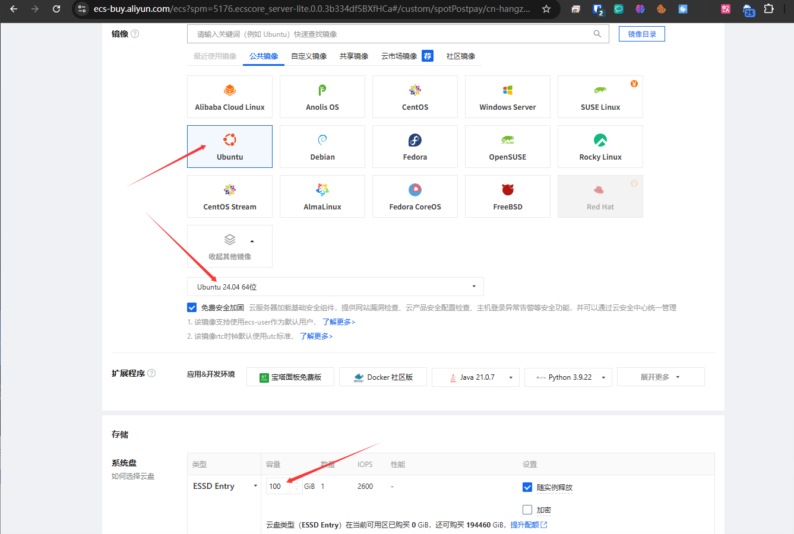
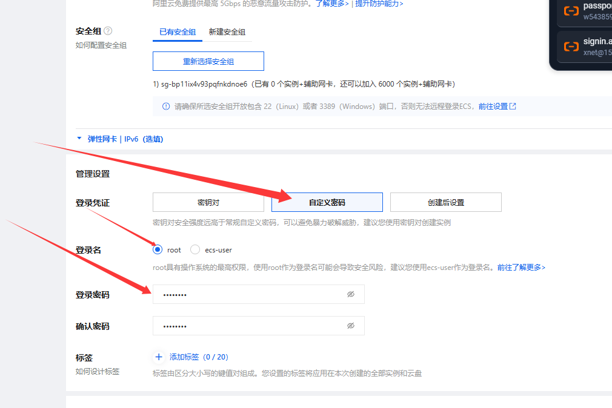
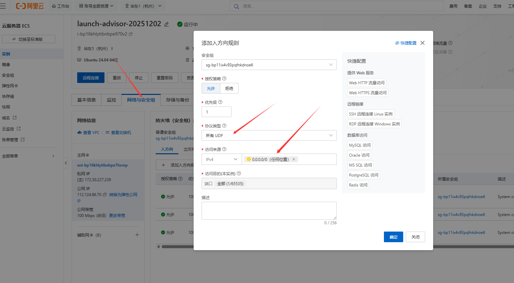
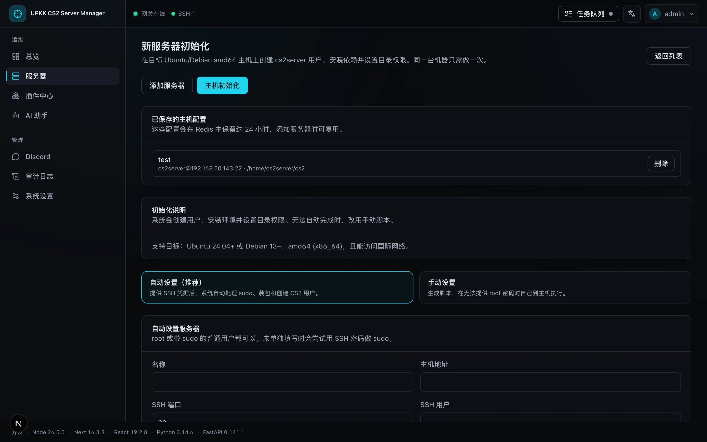
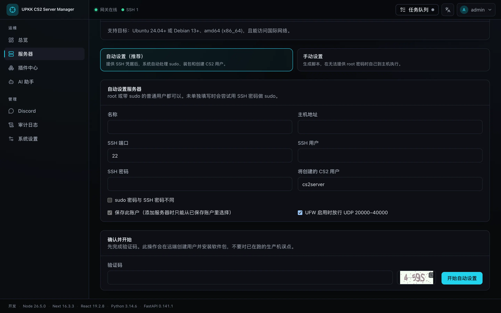
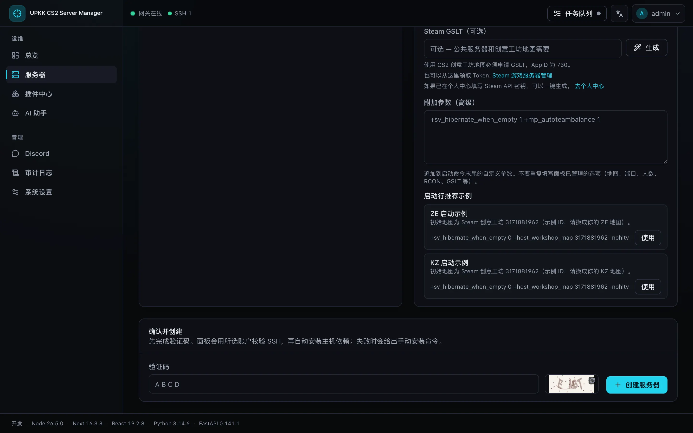
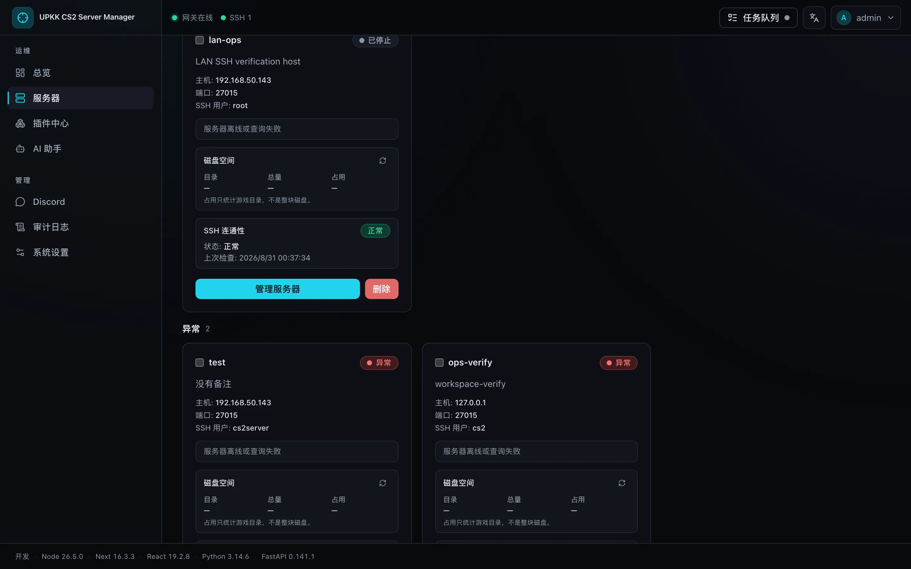
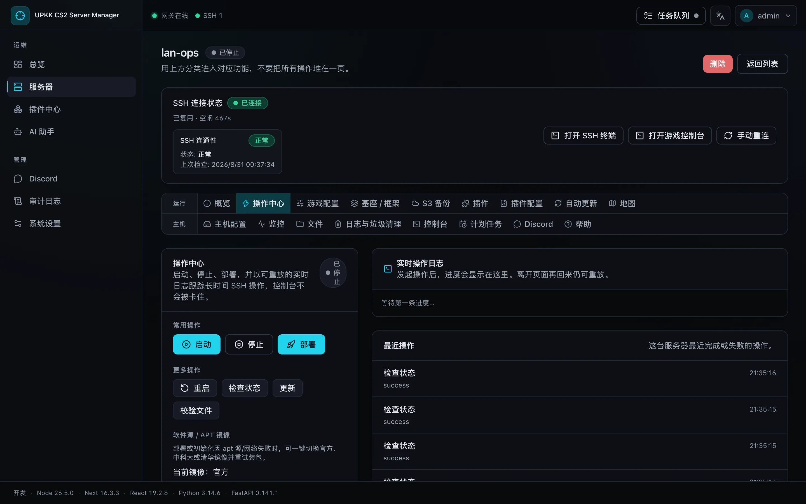
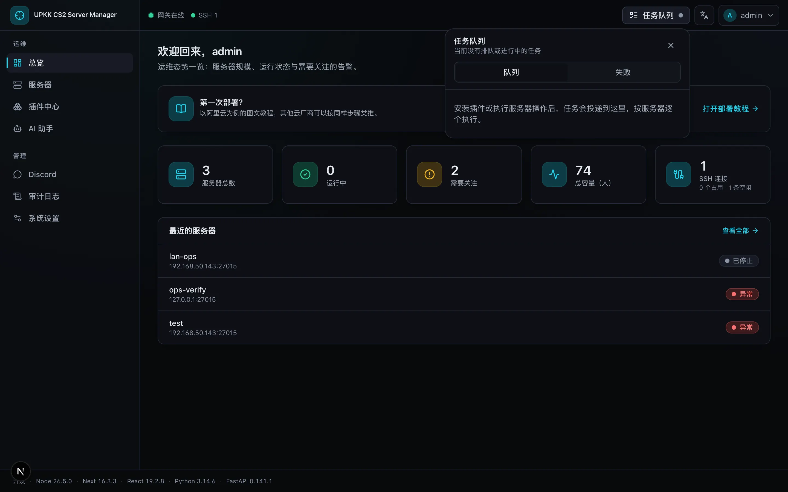

# 如何使用本面板部署 CS2 游戏服务器

不管是轻量、腾讯云、阿里云、Google Cloud 还是 Amazon Cloud，原理都类似。这里以阿里云为例。面板截图为当前 Next 控制台。

1. 选择 Ubuntu 24.04，系统盘建议 100 GiB 以上。

2. 登录凭证选自定义密码，登录名选 root。

3. 安全组放行 UDP（至少 27015），来源 0.0.0.0/0。

4. 在面板打开「服务器 → 主机初始化」。

5. 填写 root SSH 信息后开始自动设置，完成后保存 cs2server 凭据。

6. 在「添加服务器」中选择刚初始化的主机并创建。

8. 在服务器列表中打开工作区。

9. 在操作中心点击「部署」。任务进入投递队列，不必停在页面等待。

10. 右上角活动托盘查看命令、状态和实时日志。

